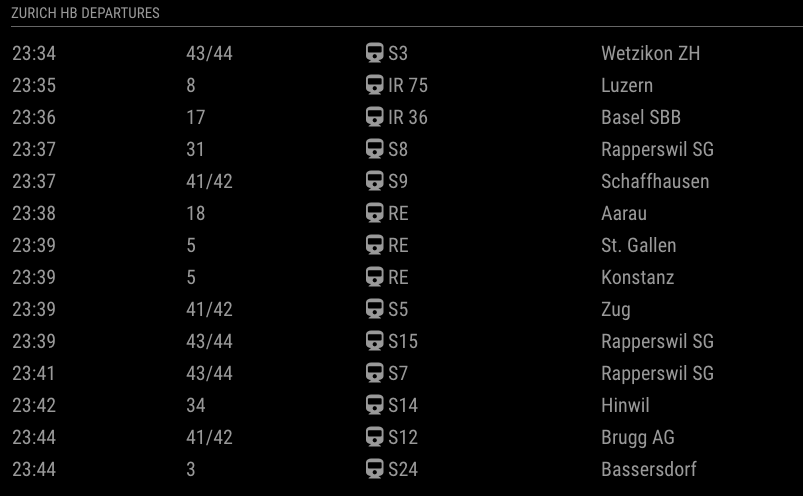

# Teslamate Location

This is a [MagicMirror](https://github.com/MichMich/MagicMirror/) module showing a
station departure or arrival board of any station in Switzerland (including bus stops).



## Installation

Go to `MagicMirror/modules` and write

```
    git clone https://github.com/donker/MMM-SwissTransTimetable
    cd MMM-SwissTransTimetable
    npm install
```

## Configuration

Here is an example configuration with description. Put it in the `MagicMirror/config/config.js` file:

```javascript
{
    module: 'MMM-SwissTransTimetable',
    position: 'top_right',
    header: 'Zurich HB',
    config: {
        stationName: "Zurich",
        nrLines: "14",
        departure: true
    }
},
```

`departure` sets whether to show a departure board or an arrival board.

Station names can be found here: https://timetable.search.ch/stop.
